 

 

## 🇪🇸 Sobre mí &nbsp;|&nbsp; 🇬🇧 About me &nbsp;|&nbsp; 🇨🇳 关于我

🇪🇸 Ingeniera en Sistemas Computacionales apasionada por el desarrollo web fullstack, con un interés creciente en el análisis de datos. Me gusta construir productos limpios, funcionales y bien pensados de principio a fin.

🇬🇧 Systems Engineer passionate about fullstack web development, with a growing interest in data analysis. I enjoy building clean, functional, and well thought-out products end to end.

🇨🇳 计算机系统工程师，热衷于全栈网页开发，并对数据分析越来越感兴趣。喜欢从头到尾打造简洁、实用、经过深思熟虑的产品。

 

## 🛠️ Stack

> 🇪🇸 *Diagrama animado — se genera al cargar la página. Requiere subir `tech-stack-orbit.svg` a la raíz de este repo.*
> 🇬🇧 *Animated diagram — plays on page load. Requires uploading `tech-stack-orbit.svg` to this repo's root.*

 

## 🌟 Proyecto destacado &nbsp;|&nbsp; Featured Project &nbsp;|&nbsp; 代表项目

<table>
<tr>
<td width="100%">

### [Xitro](https://github.com/ItzelOrtix/Xitro)

🇪🇸 Aplicación de control de finanzas personales con categorización de movimientos y exportación de reportes. Desplegada en producción sobre **Railway** con **PostgreSQL**.

🇬🇧 Personal finance management app with transaction categorization and report exports. Deployed in production on **Railway** with **PostgreSQL**.

🇨🇳 个人理财管理应用，支持交易分类和报表导出，通过 **Railway** 部署并使用 **PostgreSQL** 数据库。

</td>
</tr>
</table>

 

## 📊 Estadísticas &nbsp;|&nbsp; Statistics &nbsp;|&nbsp; 统计

 

## 📈 Visitas &nbsp;|&nbsp; Visits &nbsp;|&nbsp; 访问量

 

## 📫 Contacto &nbsp;|&nbsp; Contact &nbsp;|&nbsp; 联系方式

 

